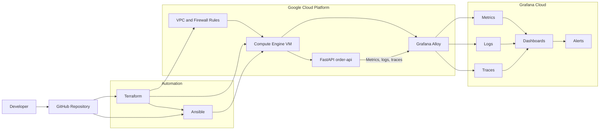

# observability_project

# GCP Incident-Ready Observability Platform

> A production-style observability and reliability engineering project using **Git, Terraform, GCP, Ansible, Docker, OpenTelemetry, Grafana Alloy, and Grafana Cloud**.

[](docs/project-design.md)
[](https://www.terraform.io/)
[](https://cloud.google.com/)
[](https://www.ansible.com/)
[](https://grafana.com/)
[](https://opentelemetry.io/)

## Overview

This project demonstrates how to build and operate an incident-ready observability platform for a containerized Python API running on Google Cloud Platform (GCP).

The platform uses Terraform to provision cloud infrastructure, Ansible to configure the virtual machine and deploy services, Docker to run the application, and Grafana Cloud to visualize and alert on metrics, logs, and traces. The application is instrumented with OpenTelemetry, while Grafana Alloy collects and forwards telemetry.

The goal is to demonstrate practical skills relevant to Site Reliability Engineering (SRE), observability, cloud operations, platform engineering, and AIOps-focused roles.

## Why this project?

Reliable services need more than dashboards. Engineers need reproducible infrastructure, clear telemetry, actionable alerts, runbooks, and a documented way to investigate and recover from incidents.

This project focuses on the following operational workflow:

```text
Provision infrastructure
    -> Configure system
    -> Deploy application
    -> Collect telemetry
    -> Detect issue
    -> Investigate metrics, logs, and traces
    -> Mitigate and verify recovery
    -> Document lessons and prevention actions
```

## Objectives

- Provision GCP infrastructure reproducibly using Terraform
- Configure a Compute Engine VM with idempotent Ansible playbooks
- Deploy a containerized Python/FastAPI application
- Instrument the service with OpenTelemetry
- Collect metrics, logs, and traces through Grafana Alloy
- Build Grafana dashboards for availability, traffic, errors, latency, and saturation
- Create actionable alerts for service down, high error rate, and high latency
- Simulate controlled incidents and document response procedures
- Maintain architecture decisions, runbooks, and a blameless postmortem
- Demonstrate safe cloud-cost management and infrastructure teardown

## Architecture



For the detailed architecture, see [Architecture documentation](docs/architecture.md).

## Technology Stack

| Area | Technology | Purpose |
|---|---|---|
| Source control | Git and GitHub | Version control, pull requests, issues, CI validation |
| Infrastructure as Code | Terraform | Reproducible GCP infrastructure provisioning |
| Cloud | Google Cloud Platform | VPC, firewall, service account, Compute Engine, Cloud Storage |
| Configuration management | Ansible | Idempotent VM configuration and application deployment |
| Application | Python and FastAPI | Sample API and controllable incident scenarios |
| Containers | Docker and Docker Compose | Local and VM-based service execution |
| Telemetry standard | OpenTelemetry | Application metrics, logs, and traces |
| Telemetry pipeline | Grafana Alloy | Collects and exports telemetry |
| Observability | Grafana Cloud | Dashboards, alerting, correlation, and investigation |
| CI validation | GitHub Actions | Terraform validation, Ansible linting, and application tests |

## Project Status

This project is under active development.

| Phase | Status | Outcome |
|---|---|---|
| 0. Project design | In progress | Scope, architecture, risks, roadmap, ADRs |
| 1. Local application | Planned | FastAPI service, Dockerfile, tests, controlled fault endpoints |
| 2. Local observability | Planned | Metrics, logs, traces, dashboards, alerts |
| 3. Terraform and GCP | Planned | GCP infrastructure modules and remote state |
| 4. Ansible deployment | Planned | VM configuration, application and Alloy deployment |
| 5. Grafana Cloud | Planned | Cloud telemetry, dashboard and alert validation |
| 6. Incident readiness | Planned | Runbooks, postmortem, demo video |
| 7. Kubernetes extension | Future | Local Kubernetes or GKE deployment |

See the full [roadmap](docs/roadmap.md).

## Repository Structure

```text
.
├── app/                         # FastAPI application, tests, Dockerfile
├── ansible/                     # Inventories, playbooks, roles, templates
├── docs/                        # Architecture, decisions, runbooks, postmortems
│   ├── adr/                     # Architecture Decision Records
│   ├── postmortems/             # Blameless incident reviews
│   ├── runbooks/                # Incident response procedures
│   └── screenshots/             # Sanitized dashboard and alert evidence
├── observability/               # Alloy, dashboards, alerts, load tests
├── scripts/                     # Bootstrap, validation, deployment, teardown helpers
├── terraform/                   # GCP modules and environments
└── .github/workflows/           # GitHub Actions workflows
```

## Planned Incident Scenarios

The project will use controlled failures to demonstrate real investigation and recovery workflows.

| Scenario | Trigger | Expected alert | Investigation evidence |
|---|---|---|---|
| Service unavailable | Stop the application container | `OrderApiDown` | Availability metric, container status, logs |
| High latency | Add artificial endpoint delay | `HighP95Latency` | Latency dashboard, trace span, correlated logs |
| High error rate | Return controlled HTTP 500 responses | `HighHttpErrorRate` | Error-rate metric, structured logs, exception trace |
| Dependency failure | Stop or misconfigure mock dependency | Health/error alert | Dependency trace, connection logs, recovery validation |

## Observability Model

The application will follow the Golden Signals model:

| Signal | Example measurement | Initial alert condition |
|---|---|---|
| Availability | Health check / `up` metric | Service unavailable for 2 minutes |
| Traffic | Requests per second | Dashboard baseline |
| Errors | Percentage of HTTP 5xx responses | More than 5% for 5 minutes |
| Latency | p95 API response duration | More than 1 second for 5 minutes |
| Saturation | CPU, memory, disk, container health | Threshold defined after baseline testing |

## Getting Started

> **Note:** The project is currently in the design phase. Local setup instructions will be added once Phase 1 is complete.

### Planned prerequisites

- Git
- Docker and Docker Compose
- Python 3.11+
- Terraform 1.x
- Ansible
- Google Cloud SDK
- GCP project with billing and budget alert configured
- Grafana Cloud account and access token

### Planned local start

```bash
git clone https://github.com/Thant-Zin-Bo/gcp-incident-ready-observability-platform.git
cd gcp-incident-ready-observability-platform

cp .env.example .env
# Update local values only. Never commit .env.

docker compose -f app/docker-compose.yml up --build
```

### Planned validation

```bash
# Application health
curl http://localhost:8000/health

# Terraform checks
cd terraform/environments/dev
terraform fmt -check
terraform init
terraform validate
terraform plan

# Ansible checks
cd ../../../ansible
ansible-lint
ansible-playbook playbooks/verify.yml
```

Detailed local setup will be available in [Local development](docs/local-development.md).

## Documentation

| Document | Description |
|---|---|
| [Project design](docs/project-design.md) | Full scope, requirements, technology choices, and success criteria |
| [Architecture](docs/architecture.md) | Component, network, and telemetry data flow |
| [Roadmap](docs/roadmap.md) | Delivery phases and milestones |
| [Risks and costs](docs/risks-and-costs.md) | GCP cost controls, security risks, and mitigations |
| [Architecture decisions](docs/adr/) | Key technical decisions and trade-offs |
| [Runbooks](docs/runbooks/) | Step-by-step operational response procedures |
| [Postmortems](docs/postmortems/) | Blameless incident reviews and prevention actions |
| [Deployment guide](docs/deployment-guide.md) | Terraform, Ansible, verification, and teardown steps |
| [Observability design](docs/observability-design.md) | SLIs, dashboards, alert rules, and telemetry pipeline |
| [Demo script](docs/demo-script.md) | Five-minute technical walkthrough |

## Security and Cost Controls

This is a learning project, but it follows basic operational safety practices:

- Do not commit secrets, Grafana tokens, Terraform state, `.tfvars`, `.env`, SSH keys, or service-account keys.
- Use `.env.example` and configuration examples with placeholder values.
- Use a dedicated GCP service account with least-privilege permissions.
- Restrict firewall rules; do not expose SSH to the public internet.
- Configure a GCP budget alert before provisioning resources.
- Use one small Compute Engine VM for Version 1.
- Destroy cloud resources after demonstrations and testing.

See [Security guidance](docs/security.md) and [Risks and costs](docs/risks-and-costs.md).

## Git Workflow

This repository uses short-lived feature branches and pull requests.

```text
main
├── feature/project-design
├── feature/local-api
├── feature/local-observability
├── feature/terraform-gcp
├── feature/ansible-configuration
├── feature/grafana-cloud
└── feature/incident-runbooks
```

Each pull request should include:

- Purpose and scope
- Validation evidence
- Security and cost impact
- Rollback plan
- Screenshots or output where relevant

See [Contributing](CONTRIBUTING.md) for details.

## Future Enhancements

- Kubernetes deployment using `kind`, `k3d`, or GKE
- Kubernetes monitoring and alerting
- Terraform-managed Grafana dashboards, alerts, and SLOs
- GitHub Actions deployment workflow
- Synthetic monitoring
- Alert enrichment and grouping using Python
- AIOps extension for anomaly detection and incident summarization
- Elastic Stack extension for log analytics and machine-learning anomaly detection
- Security scanning and policy-as-code

## Project Owner

**Thant Zin Bo**

- LinkedIn: [linkedin.com/in/thant-zin-bo-37902711](https://www.linkedin.com/in/thant-zin-bo-37902711)
- GitHub: [github.com/Thant-Zin-Bo](https://github.com/Thant-Zin-Bo)

This project supports my transition into hands-on SRE, observability, cloud operations, and AIOps engineering roles in Sweden.

## Contributing

This is primarily a personal technical portfolio project. Constructive issues and pull requests are welcome.

Please read [CONTRIBUTING.md](CONTRIBUTING.md) before contributing.

## Security

Do not report security issues through public GitHub issues. See [SECURITY.md](SECURITY.md) for responsible disclosure guidance.

## License

This project is licensed under the MIT License. See [LICENSE](LICENSE) for details.
