# GCP Incident-Ready Observability Platform

> A production-style SRE and observability portfolio project using Git, Terraform, GCP, Ansible, Docker, OpenTelemetry, Grafana Alloy, and Grafana Cloud.

[](docs/project-design.md)
[](https://www.terraform.io/)
[](https://cloud.google.com/)
[](https://www.ansible.com/)
[](https://grafana.com/)
[](https://opentelemetry.io/)

## Overview

This project demonstrates how to build and operate an incident-ready observability platform for a containerized Python API on Google Cloud Platform (GCP).

Terraform provisions cloud infrastructure, Ansible configures the Compute Engine VM and deploys services, and Grafana Alloy forwards application telemetry to Grafana Cloud. The project includes metrics, structured logs, distributed traces, dashboards, alerts, controlled incident scenarios, runbooks, and a post-incident review.

The goal is to demonstrate current hands-on capability relevant to SRE, observability, cloud operations, platform engineering, and future AIOps roles.

## Key Skills Demonstrated

- **Git and GitHub:** feature branches, pull requests, version-controlled infrastructure and documentation
- **Terraform:** GCP infrastructure provisioning, modules, remote state, variables, validation, plan, apply, and destroy
- **GCP:** VPC, subnet, firewall rules, Compute Engine, service account, Cloud Storage, and budget controls
- **Ansible:** dynamic inventory, roles, idempotent configuration, templates, and deployment playbooks
- **Docker:** containerized FastAPI application deployment
- **OpenTelemetry:** application instrumentation for metrics, logs, and traces
- **Grafana Alloy and Grafana Cloud:** telemetry pipeline, dashboards, alerts, and incident investigation
- **Operations:** runbooks, alert tuning, controlled failures, postmortems, and recovery verification

## Architecture

```mermaid
flowchart LR

    %% Styles
    classDef developer fill:#E3F2FD,stroke:#1565C0,color:#0D47A1,stroke-width:1.5px;
    classDef git fill:#FCE4EC,stroke:#C2185B,color:#880E4F,stroke-width:1.5px;
    classDef iac fill:#FFF3E0,stroke:#EF6C00,color:#E65100,stroke-width:1.5px;
    classDef gcp fill:#E8F5E9,stroke:#2E7D32,color:#1B5E20,stroke-width:1.5px;
    classDef runtime fill:#F3E5F5,stroke:#7B1FA2,color:#4A148C,stroke-width:1.5px;
    classDef telemetry fill:#E0F7FA,stroke:#00838F,color:#006064,stroke-width:1.5px;
    classDef grafana fill:#FFF8E1,stroke:#F9A825,color:#6D4C00,stroke-width:1.5px;
    classDef security fill:#FFEBEE,stroke:#C62828,color:#B71C1C,stroke-width:1.5px;

    DEV[Developer<br/>Thant Zin Bo]:::developer

    subgraph GITHUB["GitHub Repository"]
        direction TB
        REPO[Source code, configuration,<br/>documentation and runbooks]:::git
        PR[Feature branch and pull request]:::git
        CI[GitHub Actions<br/>Terraform validation<br/>Ansible lint<br/>Python tests]:::git

        REPO --> PR --> CI
    end

    DEV -->|Creates changes| PR
    CI -->|Validated changes merge| REPO

    subgraph AUTOMATION["Infrastructure and Configuration"]
        direction TB
        TF[Terraform<br/>GCP infrastructure provisioning]:::iac
        ANSIBLE[Ansible<br/>VM configuration and deployment]:::iac
    end

    REPO -->|Infrastructure code| TF
    REPO -->|Playbooks and roles| ANSIBLE

    subgraph GCP["Google Cloud Platform - Development Environment"]
        direction TB

        BUDGET[GCP budget alert<br/>and cost monitoring]:::security

        subgraph NETWORK["VPC Network"]
            direction LR
            VPC[VPC and subnet]:::gcp
            FIREWALL[Restrictive firewall rules<br/>HTTPS and controlled SSH/IAP]:::security
            VPC --> FIREWALL
        end

        STATE[(Cloud Storage<br/>Terraform remote state)]:::gcp
        SA[Dedicated service account<br/>Least privilege IAM]:::security

        subgraph VM["Compute Engine VM"]
            direction TB
            OS[Linux operating system]:::runtime
            DOCKER[Docker and Docker Compose]:::runtime

            subgraph APPSTACK["Application and Telemetry"]
                direction LR
                API[FastAPI order-api<br/>Health checks and controlled faults]:::runtime
                ALLOY[Grafana Alloy<br/>OpenTelemetry pipeline]:::telemetry
            end

            OS --> DOCKER
            DOCKER --> API
            DOCKER --> ALLOY
        end

        BUDGET -.->|Monitors cloud cost| VM
        VPC --> VM
        FIREWALL --> VM
        SA -->|Identity and permissions| VM
    end

    TF -->|Provisions| VPC
    TF -->|Provisions| STATE
    TF -->|Provisions| SA
    TF -->|Provisions| VM
    STATE -.->|Stores state| TF
    ANSIBLE -->|Configures| OS

    subgraph GRAFANA["Grafana Cloud"]
        direction TB
        METRICS[Metrics<br/>Prometheus format]:::grafana
        LOGS[Logs<br/>Structured JSON]:::grafana
        TRACES[Traces<br/>OpenTelemetry]:::grafana
        DASH[Dashboards<br/>Golden Signals and host health]:::grafana
        EXPLORE[Explore<br/>Metrics to logs to traces]:::grafana
        ALERTS[Alert rules<br/>Service down, errors, latency]:::grafana
        RUNBOOKS[Runbook links<br/>and response procedures]:::grafana

        METRICS --> DASH
        LOGS --> EXPLORE
        TRACES --> EXPLORE
        DASH --> ALERTS --> RUNBOOKS
    end

    API -->|Metrics| ALLOY
    API -->|Structured logs| ALLOY
    API -->|Traces| ALLOY

    ALLOY ==>|Exports metrics| METRICS
    ALLOY ==>|Exports logs| LOGS
    ALLOY ==>|Exports traces| TRACES

    DEV -.->|Investigates incidents| DASH
    DEV -.->|Correlates telemetry| EXPLORE
    DEV -.->|Responds using runbooks| RUNBOOKS
```



For the detailed architecture, including network rules, security assumptions, and telemetry data flow, see [Architecture documentation](docs/architecture.md).

## Project Workflow

```text
Git feature branch
    -> Pull request and automated validation
    -> Terraform provisions GCP infrastructure
    -> Ansible configures Compute Engine VM
    -> Docker deploys FastAPI application and Grafana Alloy
    -> Alloy exports metrics, logs, and traces to Grafana Cloud
    -> Grafana dashboards and alerts detect abnormal conditions
    -> Runbooks guide investigation, mitigation, and recovery
    -> Postmortem documents root cause and prevention actions
```

## Technology Stack

| Area | Technology | Purpose |
|---|---|---|
| Source control | Git and GitHub | Version control, pull requests, CI validation |
| Infrastructure as Code | Terraform | Reproducible GCP provisioning |
| Cloud | Google Cloud Platform | Network, compute, identity, storage, budget controls |
| Configuration management | Ansible | Repeatable VM configuration and deployment |
| Application | Python and FastAPI | Sample API with normal and controlled-failure behavior |
| Containers | Docker and Docker Compose | Application and local development runtime |
| Telemetry | OpenTelemetry | Metrics, logs, and distributed traces |
| Telemetry pipeline | Grafana Alloy | Receives and exports telemetry |
| Observability | Grafana Cloud | Dashboards, alerting, and investigation |
| CI | GitHub Actions | Terraform validation, Ansible linting, Python tests |

## Project Status

> The project is currently in the **planning and documentation phase**. Features listed below are planned until implementation evidence is added.

| Phase | Status | Deliverable |
|---|---|---|
| 0. Design | In progress | Project design, architecture, roadmap, ADRs, cost controls |
| 1. Local application | Planned | FastAPI service, Dockerfile, tests, health endpoint |
| 2. Local observability | Planned | Metrics, logs, traces, Grafana dashboard, alert rules |
| 3. Terraform and GCP | Planned | VPC, VM, IAM, remote state, GCP budget alert |
| 4. Ansible deployment | Planned | Roles, inventory, idempotent playbooks |
| 5. Grafana Cloud | Planned | Cloud telemetry, dashboards, alert validation |
| 6. Incident readiness | Planned | Runbooks, postmortem, demo video |
| 7. Kubernetes extension | Future | Local Kubernetes or GKE deployment |

See the detailed [roadmap](docs/roadmap.md).

## Controlled Incident Scenarios

| Scenario | Trigger | Expected evidence | Recovery |
|---|---|---|---|
| Service unavailable | Stop the application container | Availability alert, container status, logs | Restart or redeploy container |
| High latency | Inject a 3-second API delay | p95 latency alert, slow trace span, logs | Remove delay and verify recovery |
| High error rate | Trigger HTTP 500 responses | Error-rate alert, exception logs and trace | Correct configuration or disable fault |
| Dependency failure | Stop or misconfigure mock dependency | Failed dependency trace and connection logs | Restore dependency or configuration |

## Observability Model

The platform measures the Golden Signals:

| Signal | Example measurement | Initial target | Alert condition |
|---|---|---|---|
| Availability | Health endpoint / `up` metric | 99% during lab operation | Service down for 2 minutes |
| Traffic | Requests per second | Establish a normal baseline | Dashboard only |
| Errors | HTTP 5xx percentage | Less than 2% | More than 5% for 5 minutes |
| Latency | p95 request duration | Less than 500 ms | More than 1 second for 5 minutes |
| Saturation | CPU, memory, disk, container health | Establish normal baseline | Define after measurement |

## Planned Repository Structure

```text
.
├── app/                         # FastAPI application, tests and Dockerfile
├── ansible/                     # Inventory, playbooks, roles and templates
├── docs/                        # Architecture, design, ADRs, runbooks and postmortems
│   ├── adr/
│   ├── postmortems/
│   ├── runbooks/
│   └── screenshots/
├── observability/               # Alloy configuration, dashboards, alerts and load tests
├── scripts/                     # Deployment, validation and teardown helpers
├── terraform/                   # GCP modules and environment configuration
└── .github/workflows/           # GitHub Actions workflows
```

## Getting Started

> **Current state:** Local setup commands will be added after the Phase 1 application implementation is complete.

### Planned prerequisites

- Git
- Docker and Docker Compose
- Python 3.11 or newer
- Terraform 1.x
- Ansible
- Google Cloud SDK
- GCP project with billing and a budget alert
- Grafana Cloud account and access token

### Planned local workflow

```bash
git clone https://github.com/Thant-Zin-Bo/gcp-incident-ready-observability-platform.git
cd gcp-incident-ready-observability-platform

cp .env.example .env
# Add local values only. Never commit .env.

docker compose -f app/docker-compose.yml up --build
curl http://localhost:8000/health
```

## Documentation

| Document | Description |
|---|---|
| [Project design](docs/project-design.md) | Scope, goals, requirements, technology decisions and success criteria |
| [Architecture](docs/architecture.md) | Detailed components, data flow, security and network design |
| [Roadmap](docs/roadmap.md) | Project phases, milestones and completion criteria |
| [Risks and costs](docs/risks-and-costs.md) | GCP cost control, operational risks and mitigations |
| [Architecture decisions](docs/adr/) | Decisions, rationale and consequences |
| [Runbooks](docs/runbooks/) | Response procedures for controlled incidents |
| [Postmortems](docs/postmortems/) | Blameless incident reviews and prevention actions |
| [Observability design](docs/observability-design.md) | SLIs, dashboards, alerts and telemetry pipeline |
| [Deployment guide](docs/deployment-guide.md) | Terraform, Ansible, verification and teardown steps |
| [Demo script](docs/demo-script.md) | Five-minute technical project walkthrough |

## Security and Cost Controls

- No tokens, keys, `.env` files, `.tfvars`, or Terraform state files are committed to Git.
- Grafana Cloud credentials are stored through environment variables, Ansible Vault, or GitHub secrets.
- The Compute Engine VM uses a dedicated least-privilege service account.
- Firewall rules restrict inbound access; SSH is not exposed to the public internet.
- GCP billing budget alerts are enabled before provisioning resources.
- Version 1 uses one small Compute Engine VM.
- Cloud resources are destroyed after testing or demonstrations.

## Git Workflow

```text
main
├── feature/project-design
├── feature/local-api
├── feature/local-observability
├── feature/terraform-gcp
├── feature/ansible-configuration
├── feature/grafana-cloud
└── feature/incident-runbooks
```

Every pull request should include:

- Purpose and change summary
- Validation evidence
- Security and cost impact
- Rollback plan
- Screenshots or terminal output where relevant

## Future Enhancements

- Kubernetes deployment with `kind`, `k3d`, or GKE
- Kubernetes observability and troubleshooting scenarios
- Terraform-managed Grafana dashboards, alerts, and SLOs
- Automated deployment workflow through GitHub Actions
- Synthetic monitoring
- Python-based alert grouping and incident enrichment
- AIOps anomaly detection and incident summary extension
- Elastic Stack extension for log analytics and AIOps experimentation
- Security scanning and policy-as-code

## Project Owner

**Thant Zin Bo**

- LinkedIn: [linkedin.com/in/thant-zin-bo-37902711](https://www.linkedin.com/in/thant-zin-bo-37902711)
- GitHub: [github.com/Thant-Zin-Bo](https://github.com/Thant-Zin-Bo)

This project supports my transition into hands-on SRE, observability, cloud operations, and AIOps engineering roles in Sweden.

## License

This project is licensed under the MIT License. See [LICENSE](LICENSE).
